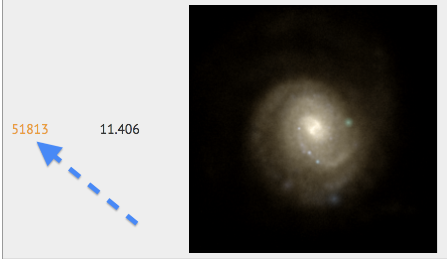

# Installation

>Dependencies required: numpy, matplotlib, astropy, cosmocalc, scipy, gc, wget

## Download the repository

After downloading the files and saving them to your working directory, we can first run the program called **setup**.  

This will download any dependency that the program requires as well as open up a webpage to the [Illustris Galaxy Observatory-](http://www.illustris-project.org/galaxy_obs/) where mock galaxies from the Illustris simulation can be viewed. 

## Choose A Sample

Use the search tool and narrow your catalog by varying mass limit contributions. 

>Search tools include: stellar mass limits, black hole mass limits, gas mass limits, and total mass limits.

### Identify the galaxy ID

The **ID** for a given galaxy can be found to the left of its image. This **ID** will later be used to specify which galaxy you'd like for simulated observations. 

Once the **ID** number to the corresponding galaxy is found, make sure to save it somewhere for later! 

## 

